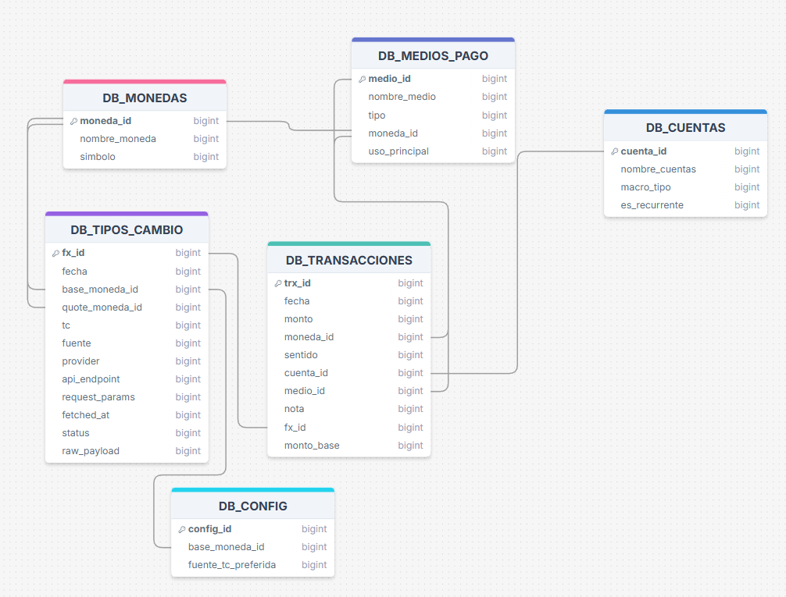

# Database Schema - Tidetrack Personal Finance

Esquema de base de datos implementado en **Google Sheets** con disciplina relacional.

---

## ️ Arquitectura General

### Backend: Google Sheets como Base de Datos

**Decisión de diseño:** Usar la hoja **DATA-ENTRY** de Google Sheets como backend con estructura relacional estricta.

**Ventajas:**
- Facilidad operativa (no requiere servidor)
- Accesibilidad inmediata
- Prototipado rápido
- Auditable visualmente

**Disciplina impuesta:**
- Tablas con encabezados fijos (fila 3)
- Columnas con significado estable
- Claves únicas (PKs)
- Claves foráneas (FKs)
- Reglas de integridad

### Ubicación Física en DATA-ENTRY

**Todas las tablas viven en posiciones fijas:**

| Tabla | Rango de Columnas | Encabezados |
|-------|-------------------|-------------|
| `DB_MONEDAS` | B:D | B3:D3 |
| `DB_TIPOS_CAMBIO` | F:Q | F3:Q3 |
| `DB_MEDIOS_PAGO` | S:W | S3:W3 |
| `DB_CUENTAS` | Y:AB | Y3:AB3 |
| `DB_TRANSACCIONES` | AD:AO | AD3:AO3 |
| `DB_CONFIG` | AQ:AS | AQ3:AS3 |

**Los datos comienzan en la fila 4.**

---

## Diagrama Entidad-Relación



---

## Tablas del Sistema

### 1. DB_MONEDAS (B3:D3)

**Objetivo:** Catálogo maestro de monedas soportadas.

**Columnas:**

| Columna | Tipo | Constraints | Descripción |
|---------|------|-------------|-------------|
| `moneda_id` (B) | TEXT | PK, UNIQUE, NOT NULL | Código estándar (ARS, USD, EUR) |
| `nombre_moneda` (C) | TEXT | UNIQUE recomendado | Nombre legible ("Peso argentino") |
| `simbolo` (D) | TEXT | - | Símbolo visual ("$", "US$") |

**Relaciones:**
- Referenciada por: `DB_TIPOS_CAMBIO` (base/quote), `DB_MEDIOS_PAGO`, `DB_TRANSACCIONES`, `DB_CONFIG`

**Reglas:**
- `moneda_id` no se modifica una vez en uso
- Usar códigos ISO 4217 cuando sea posible

---

### 2. DB_TIPOS_CAMBIO (F3:Q3)

**Objetivo:** Registro auditable de cotizaciones entre pares de monedas con trazabilidad completa.

**Semántica crítica:**
```
tc = cuántas unidades de base_moneda equivalen a 1 unidad de quote_moneda

Ejemplo: base=ARS, quote=USD, tc=1050
Significa: 1 USD = 1050 ARS
```

**Columnas:**

| Columna | Tipo | Constraints | Descripción |
|---------|------|-------------|-------------|
| `fx_id` (F) | TEXT/INT | PK, UNIQUE, NOT NULL | ID único de cotización |
| `fecha` (G) | DATE | NOT NULL | Fecha del snapshot |
| `base_moneda_id` (H) | TEXT | FK → DB_MONEDAS | Moneda base del par |
| `quote_moneda_id` (I) | TEXT | FK → DB_MONEDAS | Moneda cotizada |
| `tc` (J) | DECIMAL | > 0, NOT NULL | Valor del tipo de cambio |
| `fuente` (K) | TEXT | ENUM | "oficial", "MEP", "blue", "tarjeta", "manual" |
| `provider` (L) | TEXT | - | Proveedor técnico (ej: "exchangerate.host") |
| `api_endpoint` (M) | TEXT | - | URL consultada |
| `request_params` (N) | TEXT/JSON | - | Parámetros de la consulta |
| `fetched_at` (O) | TIMESTAMP | NOT NULL when status=ok | Momento de obtención |
| `status` (P) | TEXT | ENUM | "ok", "error", "stale" |
| `raw_payload` (Q) | TEXT | - | Respuesta cruda de API |

**Relaciones:**
- `base_moneda_id` → `DB_MONEDAS.moneda_id`
- `quote_moneda_id` → `DB_MONEDAS.moneda_id`
- Referenciada por: `DB_TRANSACCIONES.fx_id`

**Reglas:**
- `tc` siempre > 0
- `base_moneda_id` ≠ `quote_moneda_id`
- Cada update crea nuevo `fx_id` (no sobreescribir histórico)
- Solo registros con `status=ok` se usan para conversiones

---

### 3. DB_MEDIOS_PAGO (S3:W3)

**Objetivo:** Catálogo de medios de pago (efectivo, tarjetas, cuentas, billeteras).

**Columnas:**

| Columna | Tipo | Constraints | Descripción |
|---------|------|-------------|-------------|
| `medio_id` (S) | TEXT/INT | PK, UNIQUE, NOT NULL | ID único del medio |
| `nombre_medio` (T) | TEXT | UNIQUE recomendado | Nombre legible ("Efectivo", "Visa Galicia") |
| `tipo` (U) | TEXT | ENUM | "efectivo", "débito", "crédito", "billetera", "banco" |
| `moneda_id` (V) | TEXT | FK → DB_MONEDAS | Moneda natural del medio |
| `uso_principal` (W) | TEXT | ENUM | "gasto", "ahorro", "inversión", "mixto" |

**Relaciones:**
- `moneda_id` → `DB_MONEDAS.moneda_id`
- Referenciada por: `DB_TRANSACCIONES.medio_id`

**Reglas:**
- Puede haber múltiples medios con misma moneda (ej: "Efectivo ARS", "Efectivo USD")
- `tipo` es conjunto cerrado de valores

---

### 4. DB_CUENTAS (Y3:AB3)

**Objetivo:** Catálogo de cuentas/categorías para clasificar transacciones.

**Columnas:**

| Columna | Tipo | Constraints | Descripción |
|---------|------|-------------|-------------|
| `cuenta_id` (Y) | TEXT/INT | PK, UNIQUE, NOT NULL | ID único de cuenta/categoría |
| `nombre_cuentas` (Z) | TEXT | UNIQUE recomendado | Nombre legible ("Sueldo", "Alquiler") |
| `macro_tipo` (AA) | TEXT | ENUM | "Ingreso", "Gasto fijo", "Gasto variable", "Ahorro", "Dólares" |
| `es_recurrente` (AB) | BOOLEAN | - | TRUE si es periódica |

**Relaciones:**
- Referenciada por: `DB_TRANSACCIONES.cuenta_id`

**Reglas:**
- `macro_tipo` es conjunto cerrado de valores (enum)
- Puede agregar "Transferencia" para modelar conversiones

---

### 5. DB_TRANSACCIONES (AD3:AO3)

**Objetivo:** Tabla central de movimientos (ledger). Cada fila = un movimiento real.

**Columnas:**

| Columna | Tipo | Constraints | Descripción |
|---------|------|-------------|-------------|
| `trx_id` (AD) | TEXT/INT | PK, UNIQUE, NOT NULL | ID único de transacción |
| `fecha` (AE) | DATE | NOT NULL | Fecha del movimiento |
| `monto` (AF) | DECIMAL | > 0, NOT NULL | Monto nominal en moneda original |
| `moneda_id` (AG) | TEXT | FK → DB_MONEDAS, NOT NULL | Moneda del monto |
| `sentido` (AH) | TEXT | ENUM, NOT NULL | "Ingreso" o "Egreso" |
| `cuenta_id` (AI) | TEXT | FK → DB_CUENTAS, NOT NULL | ID de categoría del movimiento |
| `medio_id` (AJ) | TEXT | FK → DB_MEDIOS_PAGO, NOT NULL | ID de canal/medio usado |
| `nota` (AK) | TEXT | - | Observación libre |
| `fx_id` (AL) | TEXT | FK → DB_TIPOS_CAMBIO, CONDITIONAL | Tipo de cambio aplicado |
| `monto_base` (AM) | DECIMAL | DERIVED | Monto convertido a moneda base |
| `cuenta_nombre` (AN) | TEXT | DERIVED | Nombre legible de la cuenta (para visualización) |
| `medio_nombre` (AO) | TEXT | DERIVED | Nombre legible del medio (para visualización) |

**Relaciones:**
- `moneda_id` → `DB_MONEDAS.moneda_id`
- `cuenta_id` → `DB_CUENTAS.cuenta_id`
- `medio_id` → `DB_MEDIOS_PAGO.medio_id`
- `fx_id` → `DB_TIPOS_CAMBIO.fx_id`

**Reglas Críticas:**

#### Regla de fx_id (Congelamiento de Tipo de Cambio)
```
SI moneda_id = base_moneda_id (de DB_CONFIG):
 fx_id puede ser nulo
 monto_base = monto

SI moneda_id ≠ base_moneda_id:
 fx_id es OBLIGATORIO
 monto_base = monto * tc (según fx_id)
```

**Otras Reglas:**
- `monto` siempre > 0 (el signo lo da `sentido`)
- `sentido` solo admite "Ingreso" o "Egreso"
- `monto_base` NO se edita manualmente, es calculado

---

### 6. DB_CONFIG (AQ3:AS3)

**Objetivo:** Parámetros globales del sistema (single-row table).

**Columnas:**

| Columna | Tipo | Constraints | Descripción |
|---------|------|-------------|-------------|
| `config_id` (AQ) | INT | PK | ID de configuración (siempre 1) |
| `base_moneda_id` (AR) | TEXT | FK → DB_MONEDAS, NOT NULL | Moneda de referencia del sistema |
| `fuente_tc_preferida` (AS) | TEXT | ENUM | Fuente default para TC ("MEP", "oficial", etc.) |

**Relaciones:**
- `base_moneda_id` → `DB_MONEDAS.moneda_id`

**Reglas:**
- Solo debe existir una fila de configuración activa
- `base_moneda_id` determina cuándo `fx_id` es obligatorio
- `fuente_tc_preferida` debe coincidir con valores de `DB_TIPOS_CAMBIO.fuente`

---

## Relaciones y Flujo de Datos

### Modelo "Estrella"

```
 DB_MONEDAS (centro)
 ↓
 ┌─────────┼─────────┐
 ↓ ↓ ↓
 DB_TIPOS DB_MEDIOS DB_CONFIG
 _CAMBIO _PAGO
 ↓ ↓ ↓
 └─────────┼─────────┘
 ↓
 DB_TRANSACCIONES (hechos)
 ↑
 DB_CUENTAS
```

### Claves Foráneas (FKs)

| Tabla Hijo | Campo | Tabla Padre | Campo Padre |
|------------|-------|-------------|-------------|
| DB_TIPOS_CAMBIO | base_moneda_id | DB_MONEDAS | moneda_id |
| DB_TIPOS_CAMBIO | quote_moneda_id | DB_MONEDAS | moneda_id |
| DB_MEDIOS_PAGO | moneda_id | DB_MONEDAS | moneda_id |
| DB_TRANSACCIONES | moneda_id | DB_MONEDAS | moneda_id |
| DB_TRANSACCIONES | cuenta_id | DB_CUENTAS | cuenta_id |
| DB_TRANSACCIONES | medio_id | DB_MEDIOS_PAGO | medio_id |
| DB_TRANSACCIONES | fx_id | DB_TIPOS_CAMBIO | fx_id |
| DB_CONFIG | base_moneda_id | DB_MONEDAS | moneda_id |

---

## Reglas de Integridad

### Reglas de IDs
- Todo `_id` de catálogo debe ser único y no nulo
- No editar IDs una vez en producción

### Reglas de Montos
- `monto` siempre > 0
- `sentido` define dirección (no usar montos negativos)

### Reglas de Moneda Base y fx_id

**Condición 1:**
```
SI DB_TRANSACCIONES.moneda_id = DB_CONFIG.base_moneda_id:
 → fx_id puede ser vacío
 → monto_base = monto
```

**Condición 2:**
```
SI DB_TRANSACCIONES.moneda_id ≠ DB_CONFIG.base_moneda_id:
 → fx_id DEBE existir y ser válido
 → monto_base = monto × tc (del fx_id)
```

### Reglas de Tipo de Cambio
- `tc` > 0
- `base_moneda_id` ≠ `quote_moneda_id`
- Para misma fecha/par, diferentes filas por `fuente`

### Reglas de Trazabilidad API
- `fetched_at` obligatorio cuando `status=ok`
- `raw_payload` recomendable para debugging
- Solo `status=ok` se usa para conversiones

---

## Enums (Valores Cerrados)

Para mantener consistencia, estos campos deben tener valores controlados:

| Campo | Tabla | Valores Permitidos |
|-------|-------|-------------------|
| `sentido` | DB_TRANSACCIONES | "Ingreso", "Egreso" |
| `macro_tipo` | DB_CUENTAS | "Ingreso", "Gasto fijo", "Gasto variable", "Ahorro", "Dólares" |
| `tipo` | DB_MEDIOS_PAGO | "efectivo", "débito", "crédito", "billetera", "banco" |
| `uso_principal` | DB_MEDIOS_PAGO | "gasto", "ahorro", "inversión", "mixto" |
| `fuente` | DB_TIPOS_CAMBIO | "oficial", "MEP", "tarjeta", "blue", "manual" |
| `status` | DB_TIPOS_CAMBIO | "ok", "error", "stale" |

**Implementación sugerida:** Data Validation en Google Sheets con listas desplegables.

---

## Casos de Uso Críticos

### Caso 1: Registro de Gasto en Moneda Extranjera

**Escenario:** Usuario viaja y gasta 50 USD en un restaurant.

**Sistema base:** ARS

**Flujo:**
1. Usuario registra transacción:
 ```
 monto: 50
 moneda_id: USD
 cuenta_id: "Comidas"
 medio_id: "Visa"
 ```

2. Sistema busca último `fx_id` donde:
 ```
 base_moneda_id = ARS
 quote_moneda_id = USD
 status = ok
 fuente = fuente_tc_preferida (de CONFIG)
 ```

3. Sistema calcula:
 ```
 monto_base = 50 × 1050 = 52,500 ARS
 ```

4. Sistema guarda transacción con `fx_id` congelado

### Caso 2: Cambio de Moneda Base

**Escenario:** Usuario cambia de ARS a USD como moneda base.

**Impacto:**
- NO se recalculan `monto_base` históricos
- Nuevas transacciones usan nueva base
- Dashboards se reconvierten usando `fx_id` históricos

---

## Próximos Pasos

### Fase 1: Implementación en Sheets
- [ ] Crear hoja DATA-ENTRY
- [ ] Definir rangos con nombres (Named Ranges)
- [ ] Crear data validations para enums
- [ ] Proteger estructura (bloquear inserción de columnas)

### Fase 2: Scripts de Automatización
- [ ] Script de carga de tipos de cambio (API)
- [ ] Script de validación de integridad
- [ ] Cálculo automático de `monto_base`

### Fase 3: Migración Futura
- [ ] Si escala más allá de Sheets, migrar a PostgreSQL
- [ ] Esquema ya está normalizado y listo para SQL

---

**Versión del Schema**: 1.0 
**Backend**: Google Sheets (DATA-ENTRY) 
**Última actualización**: 2026-01-17
